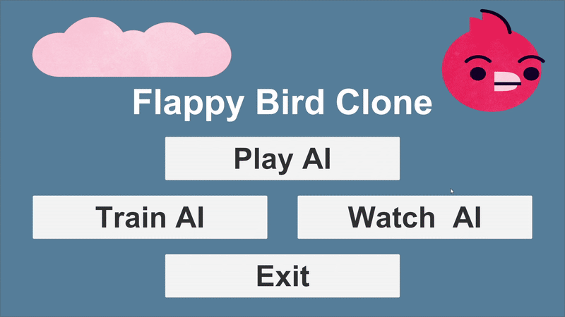

# Evolutionary_Algorithm_Flappy_Bird

A Unity game which uses a custom **Evolutionary Algorithm** to optimize a nueral network that plays Flappy Bird. The user has the abilities to **Train, Watch, and Play Against** the AI.

---

## About the Project

**Tech Used:** Unity (C#), NEAT, JsonUtility

### Training Bird
The flappy bird game was created using script to spawn and move pipes at randomized offsets and a basic action map for the players input (jump). The AI uses a NeuroEvolution of Augmenting Topologies (NEAT) inspired system to train the bird. The nueral network has 4 inputs, (bird Y position, velocity, and horizontal/vertical distance to the next pipe), 5 hidden nodes, and 1 output for the flap decision, with a hyperbolic tangent (tanh) activation function. Started training by creating  population of 50 birds each with a neural network of randomized weights and biases. Fitness is calculted based on time survive on average over 5 cycles (to account for various pipe formations). The top 10 birds automatically transfer to the next generation, while the remaining 40 mutate with a 20% change frequency and 20% change amount for each weight/bias. Training continues until a bird's average fitness over 5 cycles reaches the fitness threshold (an early stopping threshold was implemented to limit computation time if the bird never dies). The choices for the population, cycles, fitness threshold, and change frequency/amount are arbitrary, and slight deviations should yield similar results.

### Game Features
3 modes are available, the training, watching, and playing mode. 3 saved bird models "EasyBird.json", "MediumBird.json", and "HardBird.json" are saved within StreamingAssets to run the various modes. Also interface was implemented in order to make running the various modes easier. The training mode visualizes the birds throughout the training proccess and displays basic information. Once training completes, the bird is saved in StreamingAssets as "BestBird.json". The watch mode loads "HardBird.json" and lets the user watch the bird (sometimes birds may die immediately in Watching Mode, this appears to be a bug that has not yet been identified). The playing bird implements both the AI bird and player mode and loads the bird with the chosen difficulty.

# Demos

### Training Mode
- Train AI birds (specifications can be set in Unity)


### Watching Mode
- Observe AI birds trained through NEAT to evaluate performance.


### Player vs AI Mode
- Players can compete against pre-trained AI birds at different difficulty levels.


## Running Instructions

### 1. Clone the Repository  
```bash
git clone https://github.com/mcapriotti1/Evolutionary_Algorithm_Flappy_Bird.git
cd Evolutionary_Algorithm_Flappy_Bird
```

### 2. Open in Unity

Make sure you have Unity Hub and Unity 6.2 installed.
Open Unity Hub → Click “Add Project” → Select the cloned folder.
Once loaded, open the Scenes folder and select MainScene.unity to run the project.
